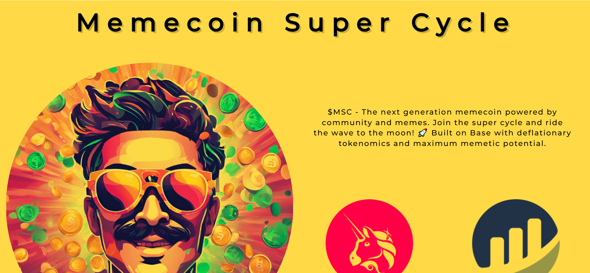
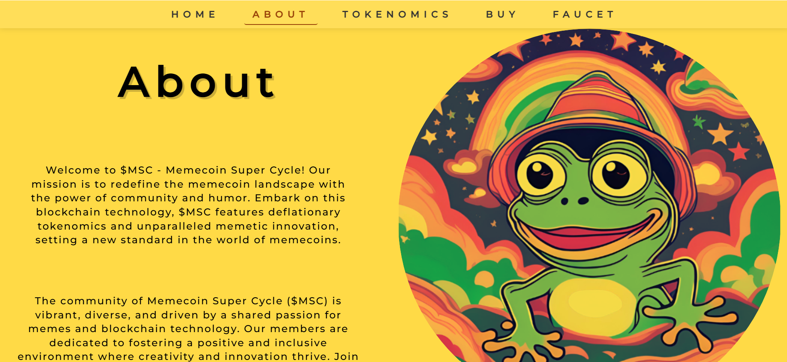
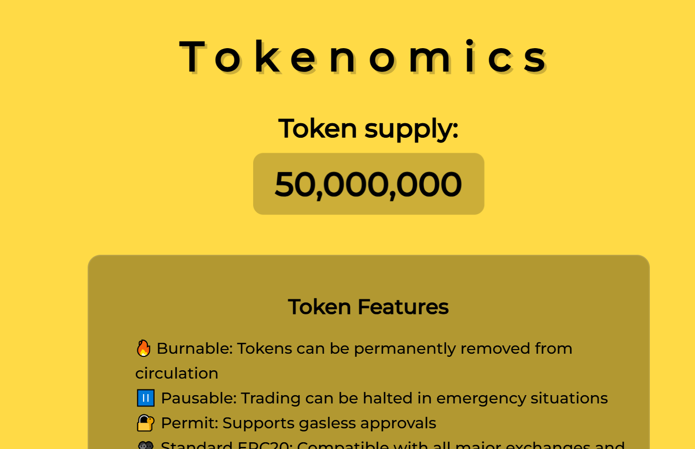
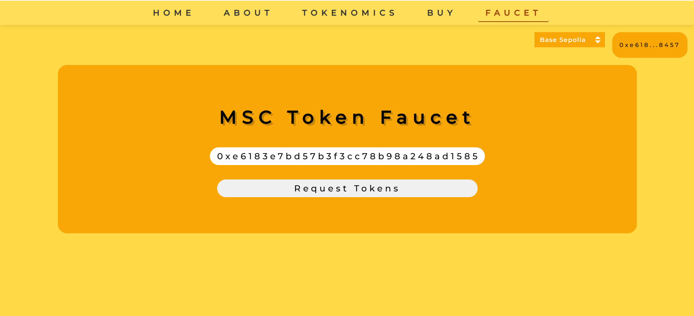

# Memecoin Super Cycle (ERC-20 Meme Token)

## Description

This is a ERC-20 token implementation in Solidity. It includes a token contract with standard ERC-20 functions, faucet with testnet tokens, and website which represents the token.

🔗 **Live Demo:** [Memecoin Super Cycle](https://memecoin-super-cycle.vercel.app/)

## Preview:









## Features

- ERC-20 token implementation with different features like cap, burn, pause, etc.
- Faucet with testnet tokens. The faucet is deployed on Sepolia and Base Sepolia testnets.
- Website which represents the token.

## Technologies

- Solidity: writing the token contract and the faucet contract.
- OpenZeppelin: using the OpenZeppelin library for the token contract and the faucet contract.
- Hardhat: writing the deployment script and the tests.
- Angular: writing the website.
- TypeScript: writing the website.
- Ethers.js: interacting with the blockchain.
- Vercel: deploying the website.

## Usage

### Prerequisites

- Node.js and npm installed
- Angular CLI installed
- Metamask or any other Web3 wallet installed

### Installation

1. Clone the repository:

   ```sh
   git clone https://github.com/yourusername/memecoin-super-cycle.git
   cd memecoin-super-cycle
   ```

2. Install dependencies:

   ```sh
   npm install
   ```

3. Navigate to the frontend directory and install dependencies:
   ```sh
   cd frontend/MemecoinSuperCycle
   npm install
   ```

### Running the Application

1. Start the Angular development server:

   ```sh
   ng serve
   ```

2. Open your browser and navigate to `http://localhost:4200`.

### Using the Faucet

1. Connect your Web3 wallet (e.g., Metamask) to the Sepolia or Base Sepolia testnet.
2. Navigate to the Faucet page on the website.
3. Click the "Connect Wallet" button to connect your wallet.
4. Once connected, click the "Request Tokens" button to receive testnet tokens.

### Switching Networks

1. Use the network switcher button on the website to switch between Sepolia and Base Sepolia testnets.
2. Confirm the network switch in your Web3 wallet.

### Additional Information

- The token contract and faucet contract are deployed on the Sepolia and Base Sepolia testnets.
- You can view the token and faucet contract addresses in the `src/app/config/networks.ts` file.
- For any issues or questions, please open an issue on the GitHub repository.

## Contributing

1. Fork the repository.
2. Create a new branch for your changes.
3. Make your changes and commit them.
4. Push your changes to your fork.
5. Open a pull request.

## Testing

The project is tested with Hardhat.

## Deployment

The project is deployed on Vercel.

## Acknowledgements

- [OpenZeppelin](https://openzeppelin.org/) for the ERC-20 token implementation and the faucet contract.
- [Hardhat](https://hardhat.org/) for the deployment script and the tests.

- [Angular](https://angular.io/) for the website.
- [TypeScript](https://www.typescriptlang.org/) for the website.
- [Ethers.js](https://ethers.org/) for interacting with the blockchain.

## Author

Cholan Vitaliy - [My GitHub Profile](https://github.com/VitalikCholan)
